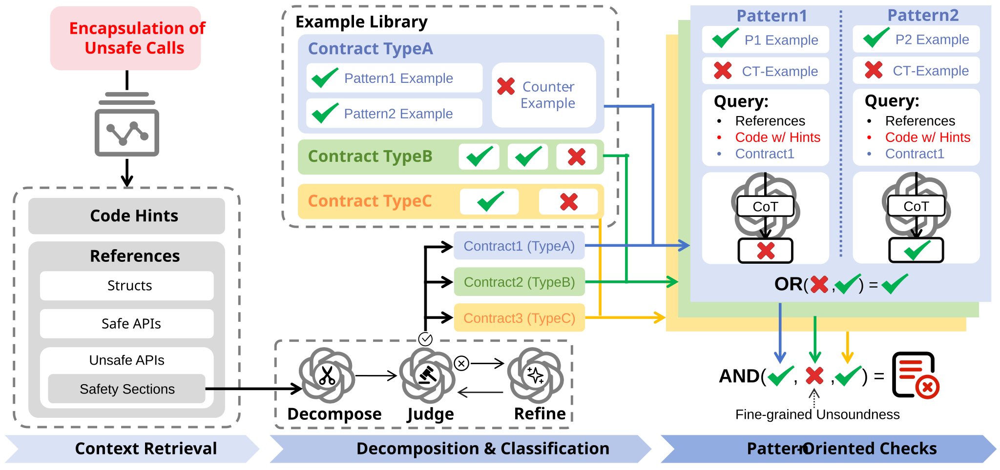

<p align="center">
  
</p>

# Safe4U

Safe4U is a command-line assistant for auditing Rust crates that use `unsafe`.
It scans a crate, finds safe functions that encapsulate unsafe operations,
retrieves local Rust context, decomposes referenced `# Safety` documentation
into concrete obligations, and asks an OpenAI-compatible model whether the
wrapper actually upholds those obligations.

The current branch is focused on direct, user-friendly crate scanning through
`cargo-safe4u`.

## Overview

<p align="center">
  
</p>

Safe4U combines static Rust context retrieval with model-based safety-contract
checking. The goal is to make unsafe-wrapper review easier to run on a real
crate and easier to triage from the terminal.

## What It Reports

Safe4U looks for potential unsound encapsulations: safe Rust APIs whose internal
`unsafe` calls may violate the safety contracts of the unsafe functions they use.

During a scan, the CLI shows:

- Progress for candidate extraction, context retrieval, safety decomposition,
  and final evaluation.
- Immediate findings when an unsound encapsulation is detected.
- A final summary of `sound`, `unsound`, and `unknown` results.
- Machine-readable JSON outputs under `result/scan/<repo-name>/`.

## Quick Start

Install dependencies in the environment you use for Safe4U:

```bash
conda activate unsafe
pip install -r requirements.txt
```

Set an API key and run a scan:

```bash
cp env-example.json env.json
# Edit env.json and set api_key/model/base_url as needed.
./cargo-safe4u --crate /path/to/rust/crate
```

If you prefer not to activate the environment, run through conda directly:

```bash
conda run -n unsafe ./cargo-safe4u --crate /path/to/rust/crate
```

Outputs are written to:

```text
result/scan/<repo-name>/
```

`env.json` is intentionally ignored by git. Keep private API keys there and use
`env-example.json` as the committed template. Any missing field falls back to
Safe4U's default value.

## OpenAI-Compatible Endpoints

Safe4U works with OpenAI-compatible Chat Completions APIs, including local
servers such as vLLM. Configure the endpoint in `env.json`:

```json
{
  "model": "your-model",
  "base_url": "http://127.0.0.1:8000/v1",
  "api_key": "EMPTY",
  "embedding_model": "text-embedding-3-small",
  "embedding_url": "",
  "embedding_key": ""
}
```

For prompts that use embedding-based examples, configure embeddings in the same
file. Unset fields use Safe4U defaults:

```json
{
  "embedding_model": "text-embedding-3-small",
  "embedding_url": "http://127.0.0.1:8001/v1",
  "embedding_key": "EMPTY"
}
```

## Common Options

```text
--crate PATH             Rust crate or workspace root to scan
--prompt NAME            Prompt config from ./prompt, defaults to Safe4U
--repo-name NAME         Override output repo name
--out-dir PATH           Override output directory
--limit N                Scan only the first N candidate functions
--include-tests          Include tests, benches, and examples
--force-context          Rebuild retrieved Rust context
--force-decompose        Re-run safety decomposition
--reuse-results          Show cached results.json without calling the model
--no-color               Disable colored terminal output
```

Example for a quick smoke run:

```bash
conda run -n unsafe ./cargo-safe4u \
  --crate /path/to/rust/crate \
  --limit 5
```

For repeated demos on a crate that already has cached artifacts, run the same
command again. Safe4U reuses candidate, context, and decomposition caches by
default:

```bash
conda run -n unsafe ./cargo-safe4u \
  --crate /path/to/rust/crate
```

To show the cached final report immediately without calling the model again:

```bash
conda run -n unsafe ./cargo-safe4u \
  --crate /path/to/rust/crate \
  --reuse-results
```

## Reading Results

The terminal output is the fastest way to review a run: it highlights immediate
unsound findings and ends with a compact summary. Full JSON artifacts are saved
under `result/scan/<repo-name>/` for later inspection or scripting.

In the final results, each checked item contains:

- `sample_label`: the scanned function.
- `result`: `sound`, `unsound`, or `unknown`.
- `response`: per-obligation model judgments and explanations.

## How Safe4U Works

1. Candidate extraction finds safe Rust functions containing `unsafe` blocks.
2. The Rust context retriever resolves surrounding type, trait, function, and
   documentation context.
3. Safety decomposition turns unsafe callee documentation into fine-grained
   obligations.
4. Evaluation checks whether the safe wrapper guarantees each obligation.
5. Results are summarized and saved for review.

## Requirements

- Linux environment, tested on Ubuntu-like systems.
- Python 3.10.
- Rust toolchain available on `PATH`.
- Python packages from `requirements.txt`.
- An OpenAI-compatible chat model endpoint.

For local LLM serving, vLLM or another OpenAI-compatible server can be used.

## Notes

Safe4U is an assistant for security review, not a formal verifier. Treat
`unsound` findings as high-priority review targets and inspect the referenced
contracts and source code. Treat `unknown` results as places where the model did
not have enough confidence to make a definitive judgment.

This `direct-use` branch is for running Safe4U as a practical tool through
`cargo-safe4u`. The default `master` branch remains the replication package for
the Safe4U paper. The replication workflow focuses on batch processing for lower
cost, while this branch uses OpenAI-compatible non-batch calls for lower
latency and a more interactive CLI experience.
